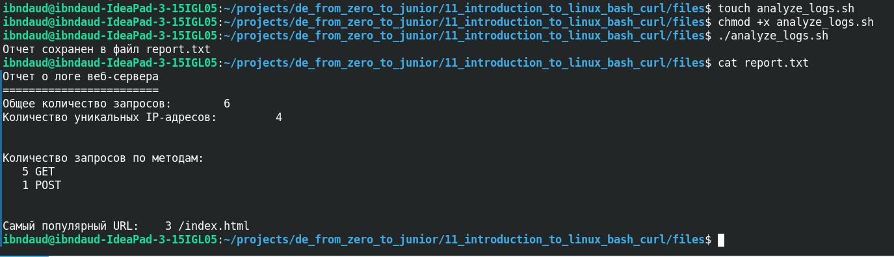

# 📜 Анализ логов веб-сервера (Bash + awk)

Итоговое задание №4 модуля **«Введение в Linux | Bash | cURL»** курса **[Data Engineer с нуля до junior](https://stepik.org/course/137235)** (NovaData, Stepik).

## Что делает скрипт

`analyze_logs.sh` за один проход `awk` по логу веб-сервера (`access.log`) собирает отчёт:

- общее количество запросов;
- количество уникальных IP-адресов;
- количество запросов по методам (GET / POST);
- самый популярный URL.

Результат записывается в `report.txt`.

## Пример вывода

Из `report.txt` в этом репозитории (на учебном логе):

```text
Отчет о логе веб-сервера
========================
Общее количество запросов:     6
Количество уникальных IP-адресов:   4

Количество запросов по методам:
   5 GET
   1 POST

Самый популярный URL:   3 /index.html
```

## Как запустить

```bash
# положите свой access.log рядом со скриптом (в git он не входит)
chmod +x analyze_logs.sh
./analyze_logs.sh
cat report.txt
```



## Структура

```
├── analyze_logs.sh    # скрипт анализа (awk)
├── report.txt         # пример отчёта на учебном логе
├── screenshot.png     # скриншот запуска
└── README.md
```

> Файл `access.log` намеренно не хранится в репозитории — подставьте свой лог в формате Common/Combined Log Format.
